# Quest 🔍

## **AI-Powered Blockchain Explorer for Qubic Network**

Quest is an intelligent blockchain explorer that lets you query the Qubic blockchain using natural language. Ask questions, get insights, and visualize on-chain data—all through a conversational AI interface powered by OpenAI.

---

## ✨ Key Features

### 🤖 AI Assistant

Chat with your blockchain data using natural language queries. The AI understands context and can:

- Query transactions, wallets, and trading activity
- Analyze asset performance and market trends
- Display live QUBIC price with 7-day charts
- Show top token holders with real-time balances
- Visualize QX trades, QEARN staking, CCF deposits, and QBAY NFTs with images
- View detailed NFT information including traits, collections, and ownership

### 🛠️ 17 Specialized Tools

1. **query_recent_transactions** - Browse recent blockchain activity
2. **query_asset_trades** - Analyze QX marketplace trades (Buy/Sell)
3. **query_wallet_activity** - Track specific wallet transactions
4. **get_tick_info** - Get block details by tick number
5. **get_database_stats** - View database health and coverage
6. **get_current_tick** - Fetch latest block from RPC
7. **query_qearn_transactions** - QEARN staking deposits
8. **query_ccf_transactions** - Computor Commitment Fund deposits
9. **query_qbay_transactions** - QBAY NFT marketplace activity with images
10. **get_nft_details** - View detailed NFT metadata, traits, and ownership
11. **query_top_holders** - Top 100 richest wallets (live balances)
12. **get_asset_price** - QX asset prices in QUBIC and USD
13. **get_qubic_price** - Live QUBIC price with 7-day chart
14. **query_wallet_portfolio** - View all QX assets owned by a wallet
15. **get_market_overview** - QX exchange statistics and metrics
16. **compare_assets** - Compare multiple QX assets side-by-side
17. **query_whale_transactions** - Track large QUBIC transfers (1M+ default)

### 📈 Screenshots

**Main Chat Interface:**
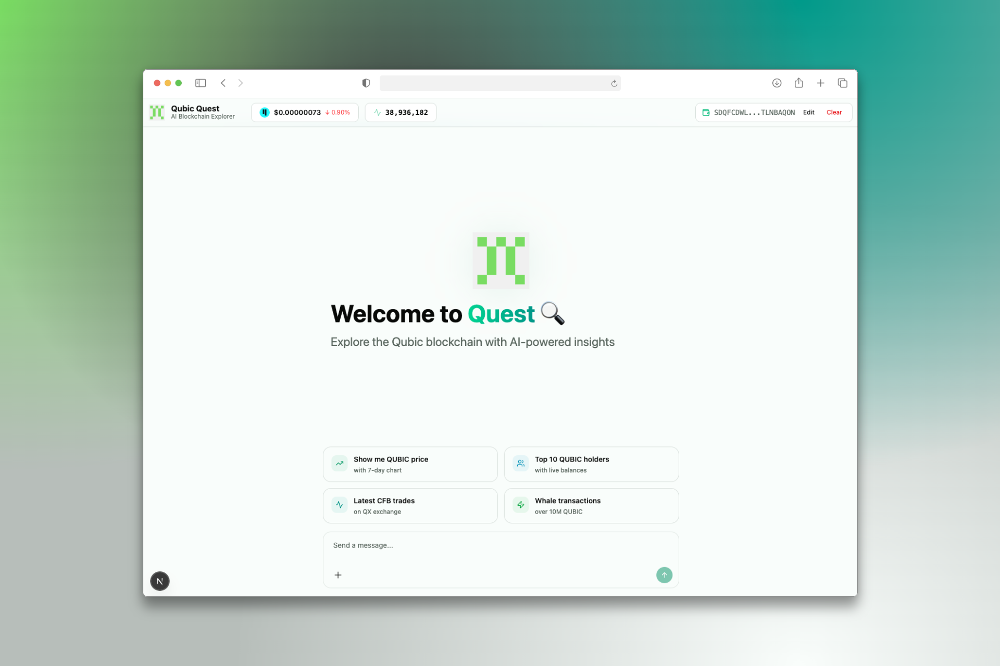

**Transaction Tables:**
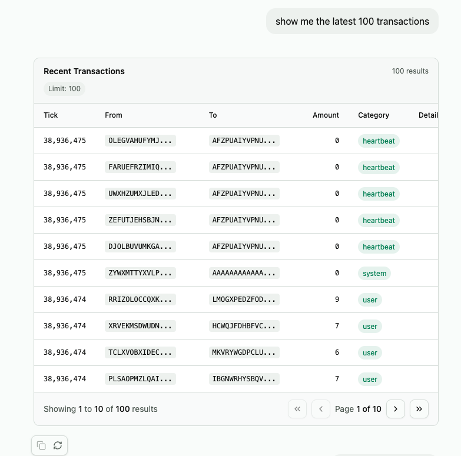

**Asset Trading Analysis:**
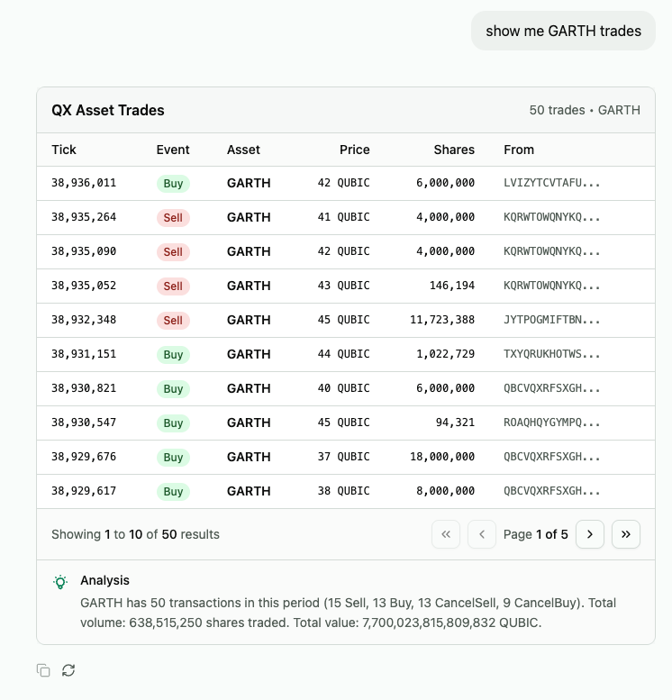

**Wallet Activity & Portfolio:**


**DeFi Features (QEARN & CCF):**
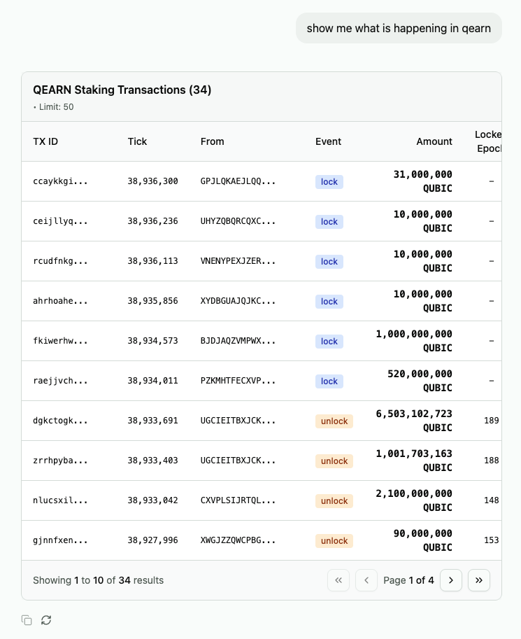
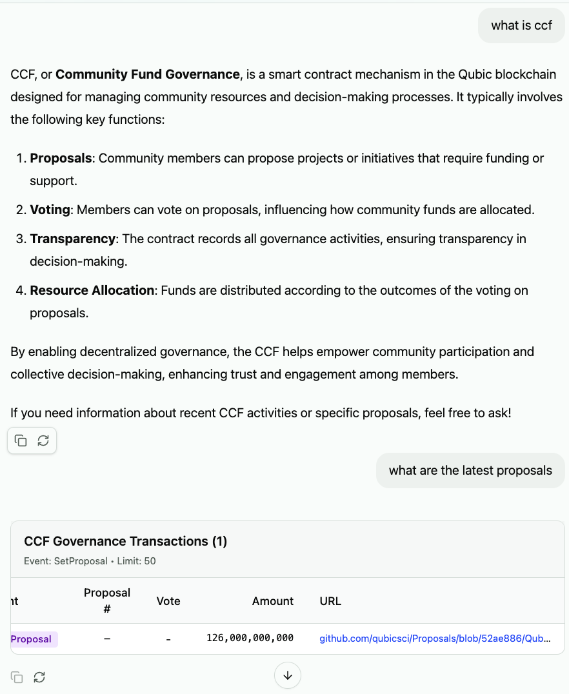

**NFT Marketplace:**
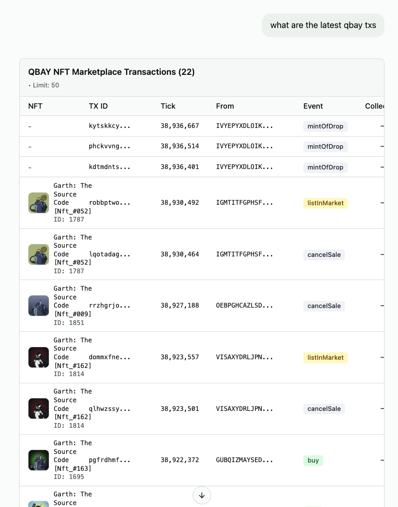
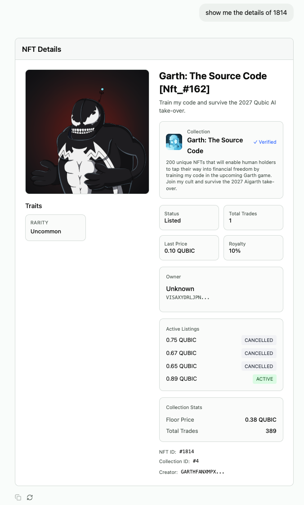

**Live Price Charts & Market Data:**
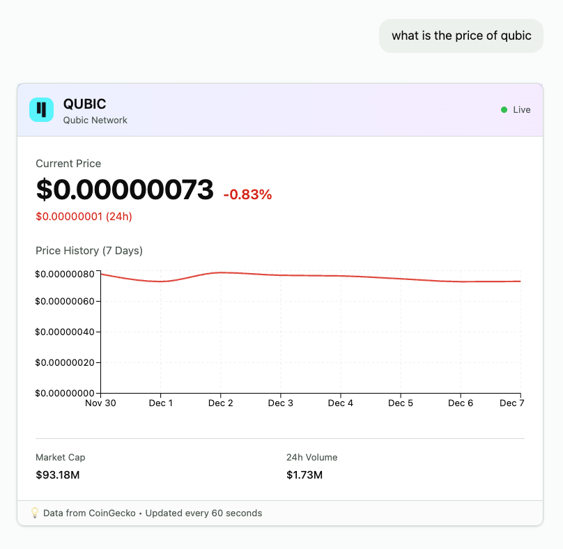
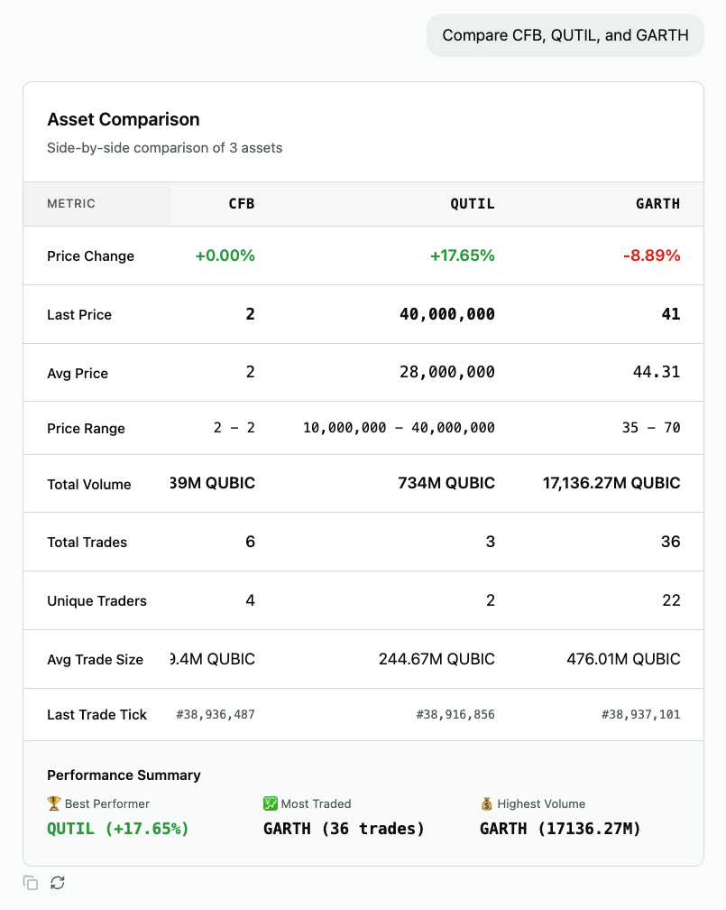

**Top Holders & Whale Tracking:**
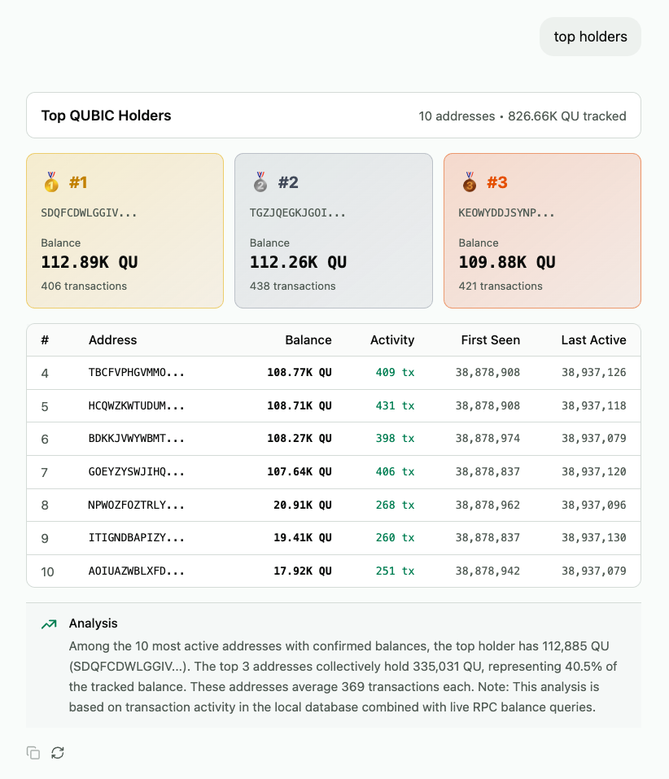
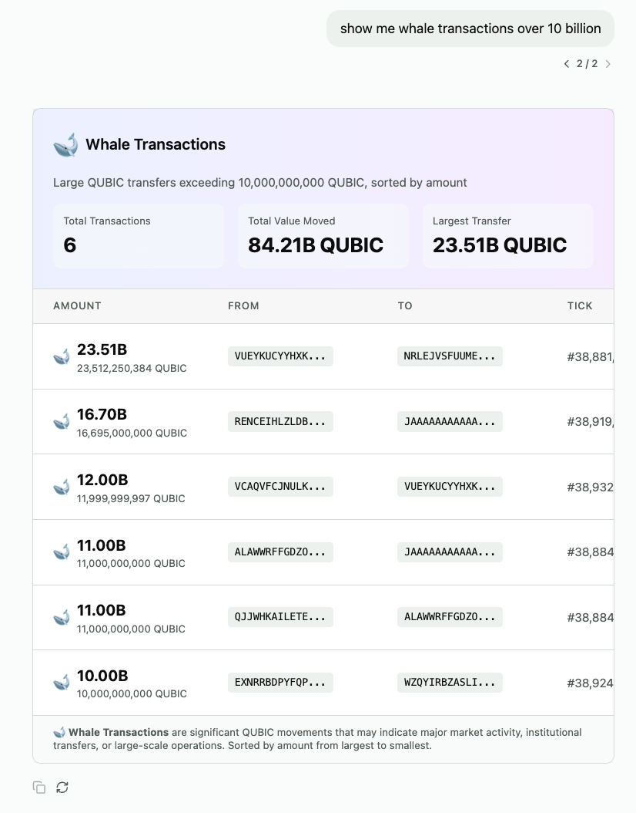

---

## 🚀 Getting Started

### Prerequisites

- Node.js 18+ and npm
- SQLite database with Qubic transactions (see [data ingestion guide](./MVP_README.md#database-setup))
- OpenAI API key

### Installation

1. **Clone the repository:**

```bash
git clone <your-repo-url>
cd qubic-quest
```

2. **Install dependencies:**

```bash
npm install
```

3. **Set up environment variables:**

```bash
cp .env.example .env.local
```

Add your OpenAI API key to `.env.local`:

```env
OPENAI_API_KEY=your-openai-api-key-here
```

4. **Configure database path:**

Edit `lib/db.ts` to point to your SQLite database:

```typescript
const DB_PATH = '/path/to/your/deepsight.db';
```

5. **Run the development server:**

```bash
npm run dev
```

Open [http://localhost:3000](http://localhost:3000) to start exploring!

---

## 🏗️ Architecture

### Tech Stack

- **Frontend:** Next.js 16 (App Router), React 19, TypeScript, Tailwind CSS
- **AI Framework:** Vercel AI SDK v5 + assistant-ui v0.11.47
- **LLM:** OpenAI GPT-4o-mini (fast, cost-effective)
- **Database:** SQLite via better-sqlite3
- **Charts:** Recharts for price visualization
- **UI Components:** shadcn/ui + Radix UI primitives
- **Blockchain RPC:** Qubic RPC API for live data

### Project Structure

```
qubic-quest/
├── app/
│   ├── api/chat/route.ts      # AI chat endpoint with 17 tools
│   ├── layout.tsx              # Root layout with metadata
│   ├── page.tsx                # Main chat interface
│   └── globals.css             # Global styles
├── components/
│   ├── assistant-ui/           # Chat UI components
│   ├── tool-ui/                # Specialized visualizations for each tool
│   │   ├── transaction-table/  # Transaction list view
│   │   ├── asset-trades/       # QX trading data
│   │   ├── wallet-activity/    # Wallet timeline
│   │   ├── wallet-portfolio/   # Wallet QX asset holdings
│   │   ├── qearn-table/        # Staking deposits
│   │   ├── ccf-table/          # CCF deposits
│   │   ├── qbay-table/         # NFT marketplace
│   │   ├── nft-card/           # NFT detail view
│   │   ├── top-holders/        # Rich list with live balances
│   │   ├── whale-transactions/ # Large QUBIC transfers
│   │   ├── asset-price/        # QX asset pricing
│   │   ├── qubic-price/        # QUBIC price + 7-day chart
│   │   ├── market-overview/    # QX market statistics
│   │   ├── compare-assets/     # Asset comparison tool
│   │   ├── info-cards/         # Tick info, stats, balance
│   │   └── rpc-info/           # RPC connection status
│   └── ui/                     # shadcn/ui base components
├── lib/
│   ├── db.ts                   # SQLite database connection
│   ├── queries.ts              # All database query functions
│   ├── rpc.ts                  # Qubic RPC + CoinGecko API
│   └── utils.ts                # Utility functions
└── docs/                       # Documentation and guides
```

### How It Works

1. **User asks a question** in natural language
2. **GPT-4o-mini** analyzes the query and selects the appropriate tool
3. **Backend executes** the database query or RPC call
4. **AI streams results** back to the frontend
5. **Custom UI components** render the data beautifully
6. **User can refine** the query or ask follow-up questions

---

## 💬 Example Queries

**Try asking:**

- "Show me the latest transactions"
- "What's the current QUBIC price?"
- "Who are the top 10 holders?"
- "Show me all CFB trades"
- "What's my wallet portfolio?"
- "Show me recent QBAY NFT listings"
- "Track whale transactions over 10M QUBIC"

See [TEST_QUERIES.md](./TEST_QUERIES.md) for comprehensive examples!

---

## 🎯 Features

✅ 17 AI-powered query tools with custom visualizations  
✅ Live QUBIC price tracking with 7-day charts  
✅ QX asset pricing and market overview  
✅ Real-time wallet balances via RPC  
✅ NFT marketplace with metadata and images  
✅ Whale transaction monitoring  
✅ Mobile responsive design  

See [TODO.md](./TODO.md) for the full roadmap.

---

## 📚 Documentation

- **[TEST_QUERIES.md](./TEST_QUERIES.md)** - Example queries for all tools
- **[DEBUGGING_GUIDE.md](./DEBUGGING_GUIDE.md)** - Troubleshooting guide
- **[TODO.md](./TODO.md)** - Roadmap and task tracking

---

## 📄 License

MIT License

---

Built with ❤️ for the Qubic community
